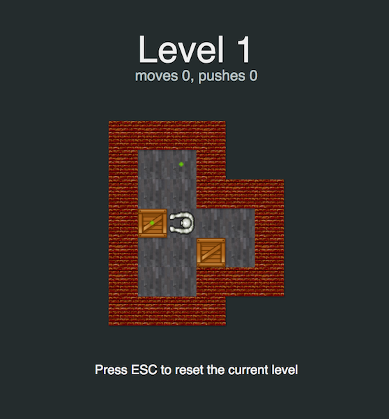

Sokoban
=======

There is implementation of [sokoban game](https://ru.wikipedia.org/wiki/Sokoban) on [elm language](http://elm-lang.org)

You can play this game [right now](https://ufocoder.github.io/sokoban/dist/index.html).



## Development

To build bunlde run the followings:
```
elm-make ./src/Main.elm --output dist/bundle.js
```

 
## Content 
Sokoban levels was taken from [Microcosmos Levels](http://sneezingtiger.com/sokoban/levels/microbanText.html)


## Contributing

I would be thankful for your [issues](https://github.com/ufocoder/sokoban/issues) and [pull requests](https://github.com/ufocoder/sokoban/pulls)